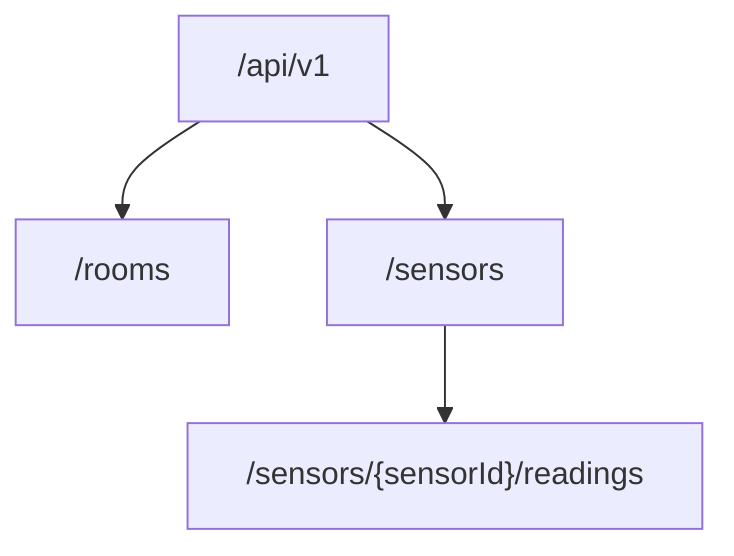
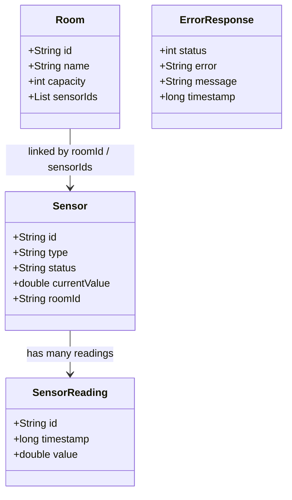

# Smart Campus - Sensor & Room Management API
Module: 5COSC022W Client-Server Architectures (2025/26)  
Student: Shenuka Dias - w2151948  
GitHub: Repository Link

A RESTful API for the university Smart Campus initiative, built with JAX-RS (Jersey) and run on an embedded Grizzly HTTP server. The service manages rooms, sensors deployed within them, and a historical log of sensor readings. All data is stored in memory and no database technology is used.

## Setup & Run Guide
### 1. Requirements
- Java JDK 17 or higher
- Maven
- NetBeans IDE or any Java IDE

### 2. Download Project
```bash
git clone <your-repository-url>
cd smartCampusApi
```

### 3. Open Project
- Open NetBeans
- Go to `File -> Open Project`
- Select the project folder

### 4. Run the Project
You can run the project in either of these ways:

Using NetBeans:
- Right-click the project
- Select `Run`

Using Maven:
```bash
mvn clean package
mvn exec:java -Dexec.mainClass="com.mycompany.smartcampusapi.SmartCampusApi"
```

### 5. Access API
Open in browser or Postman:

```text
http://localhost:8080/api/v1/
```

## API design overview
The API mirrors the campus structure through a simple resource hierarchy. Rooms are top-level resources, sensors are managed separately but linked to rooms by `roomId`, and sensor readings are exposed as a nested sub-resource under a sensor. A discovery endpoint at the API root provides metadata and entry links to the main collections.

## Resource hierarchy


## Domain model relationships


## Endpoint summary
| Method | Path | Description |
|---|---|---|
| GET | `/api/v1/` | Discovery metadata, version, resource links |
| GET, POST | `/api/v1/rooms` | List all rooms / create a new room |
| GET, DELETE | `/api/v1/rooms/{roomId}` | Get room detail / delete a room |
| GET, POST | `/api/v1/sensors` | List sensors with optional `type` filter / register a sensor |
| GET | `/api/v1/sensors/{sensorId}` | Get a single sensor |
| GET, POST | `/api/v1/sensors/{sensorId}/readings` | Reading history / append a new reading |

Models: `Room`, `Sensor`, `SensorReading`, `ErrorResponse`.

## Sample curl commands
```bash
# Discovery
curl -i "http://localhost:8080/api/v1/"

# List all rooms
curl -i "http://localhost:8080/api/v1/rooms"

# Create a room
curl -i -X POST -H "Content-Type: application/json" \
  -d '{"id":"ENG-201","name":"Engineering Lab","capacity":35,"sensorIds":[]}' \
  "http://localhost:8080/api/v1/rooms"

# Get a single room
curl -i "http://localhost:8080/api/v1/rooms/ENG-201"

# Delete a room
curl -i -X DELETE "http://localhost:8080/api/v1/rooms/ENG-201"

# List sensors
curl -i "http://localhost:8080/api/v1/sensors"

# Filter sensors by type
curl -i "http://localhost:8080/api/v1/sensors?type=CO2"

# Register a sensor
curl -i -X POST -H "Content-Type: application/json" \
  -d '{"id":"CO2-001","type":"CO2","status":"ACTIVE","currentValue":0.0,"roomId":"ENG-201"}' \
  "http://localhost:8080/api/v1/sensors"

# Post a reading
curl -i -X POST -H "Content-Type: application/json" \
  -d '{"id":"READ-001","timestamp":1713868800000,"value":22.3}' \
  "http://localhost:8080/api/v1/sensors/CO2-001/readings"

# Get readings history
curl -i "http://localhost:8080/api/v1/sensors/CO2-001/readings"
```

## Written Report (Answers to the Brief)
### Part 1: Service Architecture & Setup
**Q: Explain the default lifecycle of a JAX-RS Resource class. Is a new instance instantiated for every incoming request, or does the runtime treat it as a singleton? Elaborate on how this architectural decision impacts the way you manage and synchronize your in-memory data structures (maps/lists) to prevent data loss or race conditions.**

By default, JAX-RS resource classes are request-scoped. This means the runtime normally creates a new instance of a resource class for each incoming HTTP request. In this project, classes such as `RoomResource`, `SensorResource`, and `DiscoveryResource` do not store long-term state inside instance fields. Instead, shared application data is stored centrally in the `DataStore` class using static in-memory collections.

This design matters because request-scoped resources are recreated for each request, so any data placed directly inside a resource object would be lost after the response is sent. To persist data across requests, this implementation stores rooms, sensors, and readings in shared in-memory collections inside `DataStore`.

Because these collections are shared across concurrent requests, synchronization must be considered. In this implementation, the shared maps are wrapped using synchronized collection wrappers, and reading lists are created as synchronized lists. This keeps the in-memory design aligned with the coursework requirement while making the shared state safer under concurrent access.

**Q: Why is the provision of Hypermedia (links and navigation within responses) considered a hallmark of advanced RESTful design (HATEOAS)? How does this approach benefit client developers compared to static documentation?**

Hypermedia is a key part of mature RESTful design because it allows the server to guide the client through the API by returning navigational links in responses. In this project, the discovery endpoint at `GET /api/v1/` returns API metadata and links to the main resource collections such as `/api/v1/rooms` and `/api/v1/sensors`.

This approach benefits client developers because the API becomes self-describing. A client can start from the root endpoint and discover the next available resources without relying only on external documentation. Compared to static documentation alone, this reduces coupling to hardcoded URLs and makes the API easier to explore and evolve over time.

### Part 2: Room Management
**Q: When returning a list of rooms, what are the implications of returning only IDs versus returning the full room objects? Consider network bandwidth and client side processing.**

In this implementation, `GET /api/v1/rooms` returns full `Room` objects rather than only room IDs. Returning only IDs would reduce response size and save some network bandwidth, which can be useful for very large collections. However, it would force the client to make extra requests to fetch the details of each room, increasing round trips and client-side orchestration.

Returning full room objects gives the client useful information such as `id`, `name`, `capacity`, and `sensorIds` in a single response. This simplifies client-side processing and is practical for this coursework-sized in-memory API, where the payload size remains manageable.

**Q: Is the DELETE operation idempotent in your implementation? Provide a detailed justification by describing what happens if a client mistakenly sends the exact same DELETE request for a room multiple times.**

Yes, the `DELETE /api/v1/rooms/{roomId}` operation is idempotent in terms of server state. If the room exists and has no linked sensors, the first request removes it and returns `204 No Content`. If the same request is sent again, the room is already absent, so the API returns `404 Not Found`.

This still satisfies idempotency because repeating the same request does not create additional state changes after the first successful deletion. The final server state remains the same: the room is not present.

If the room still contains linked sensors, the API throws `RoomNotEmptyException`, which is mapped to `409 Conflict`. Repeating the same request under the same conditions will continue to return the same result without changing the system state, so that behaviour is also idempotent.

### Part 3: Sensor Operations & Linking
**Q: We explicitly use the @Consumes(MediaType.APPLICATION_JSON) annotation on the POST method. Explain the technical consequences if a client attempts to send data in a different format, such as text/plain or application/xml. How does JAX-RS handle this mismatch?**

The `@Consumes(MediaType.APPLICATION_JSON)` annotation on the POST endpoints tells the JAX-RS runtime that those methods only accept JSON request bodies. If a client sends a different media type such as `text/plain` or `application/xml`, Jersey will not find a suitable message body reader for the request that matches the declared media type for the method.

As a result, the framework rejects the request before the resource method is executed and normally responds with `415 Unsupported Media Type`. This behaviour helps enforce a clear contract for the API and prevents unsupported payload formats from being processed incorrectly.

**Q: You implemented this filtering using @QueryParam. Contrast this with an alternative design where the type is part of the URL path (e.g., /api/v1/sensors/type/CO2). Why is the query parameter approach generally considered superior for filtering and searching collections?**

Using `@QueryParam("type")` for `GET /api/v1/sensors?type=CO2` is more appropriate because `/sensors` is still the same collection resource, while the query parameter simply refines which items from that collection should be returned. That matches the normal REST convention that query parameters are used for filtering, sorting, and searching rather than representing a different resource identity.

It is also more flexible. Additional filters can be added later, such as status or room ID, without creating many extra path patterns. A path like `/sensors/type/CO2` is less expressive for combined filters and makes the API structure more rigid.

### Part 4: Deep Nesting with Sub-Resources
**Q: Discuss the architectural benefits of the Sub-Resource Locator pattern. How does delegating logic to separate classes help manage complexity in large APIs compared to defining every nested path (e.g., sensors/{id}/readings/{rid}) in one massive controller class?**

This project uses the sub-resource locator pattern in `SensorResource` through the method annotated with `@Path("/{sensorId}/readings")`, which returns a `SensorReadingResource` instance. That returned class then handles the HTTP methods for reading history and adding new readings for the selected sensor.

The main architectural benefit is separation of concerns. `SensorResource` remains focused on sensor collection and single-sensor operations, while `SensorReadingResource` handles only reading-related behaviour. This makes the code easier to understand, maintain, and extend.

If all nested paths were handled inside one large resource class, the class would become harder to read, test, and modify as the API grows. Delegating nested responsibilities to a separate sub-resource keeps each class focused and reduces complexity.

### Part 5: Error Handling, Exception Mapping & Logging
**Q: Why is HTTP 422 often considered more semantically accurate than a standard 404 when the issue is a missing reference inside a valid JSON payload?**

In this API, when a client sends a valid JSON request to create a sensor but provides a `roomId` that does not exist, the endpoint itself is valid and reachable. The problem is not that the URI is missing; the problem is that the payload contains a reference to a related resource that cannot be satisfied.

For that reason, `422 Unprocessable Entity` is more semantically accurate than `404 Not Found`. It tells the client that the request body was understood but the operation could not be completed because the submitted data is logically invalid.

**Q: From a cybersecurity standpoint, explain the risks associated with exposing internal Java stack traces to external API consumers. What specific information could an attacker gather from such a trace?**

Exposing internal Java stack traces to clients is dangerous because it leaks implementation details that should remain private. A stack trace can reveal package names, class names, method names, internal file structure, and details about the libraries or frameworks in use. That information can help an attacker map the internal design of the application and look for known weaknesses.

To reduce this risk, the project includes a catch-all `ExceptionMapper<Throwable>` that logs the full exception server-side and returns a generic `500 Internal Server Error` JSON response instead of exposing raw exceptions to clients. This prevents the API from leaking internal debugging information through default server error pages or raw stack traces.

**Q: Why is it advantageous to use JAX-RS filters for cross-cutting concerns like logging, rather than manually inserting Logger.info() statements inside every single resource method?**

Using JAX-RS filters for logging is better because logging is a cross-cutting concern that applies to the whole API rather than to one specific business operation. In this project, `LoggingFilter` implements both `ContainerRequestFilter` and `ContainerResponseFilter`, allowing the API to log incoming request method and URI as well as outgoing response status in one central place.

This avoids repetitive logging code inside every resource method, keeps the resource classes focused on application behaviour, and ensures logging is applied consistently across all endpoints. It also makes future changes to logging easier because the behaviour is maintained in a single class instead of being duplicated throughout the codebase.

## Video demonstration
The video demonstration was prepared separately for Blackboard submission.

## References
- University of Westminster, 5COSC022W Client-Server Architectures coursework brief
- JAX-RS / Jersey documentation used for REST resource development
- No Spring Boot or database technology was used, in line with the coursework requirements
